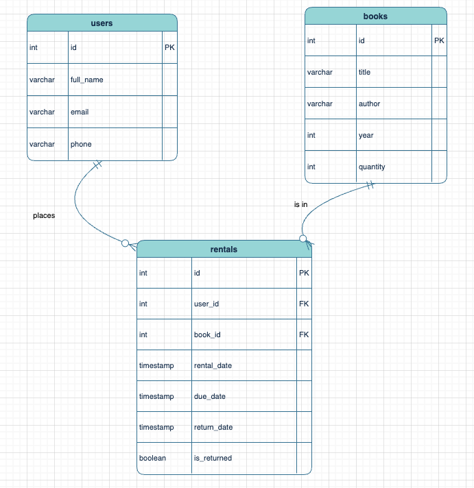

# Library Management System - Project Summary

## ✅ Project Complete

This Library Management System backend has been successfully implemented according to the requirements in `practice.md`.

## 🏗️ Implementation Overview

### Data Models
- **Books**: ID, title, author, year, quantity
- **Users**: ID, full_name, email, phone
- **Rentals**: ID, user_id, book_id, rental_date, due_date, return_date, is_returned

### Entity Relationship Diagram (ERD)

### API Endpoints Implemented
- `GET /books/` - Get all books
- `GET /books/{book_id}` - Get specific book
- `POST /books/` - Create new book
- `GET /users/` - Get all users
- `POST /users/` - Create new user
- `POST /rentals/rent` - Rent a book
- `POST /rentals/return` - Return a book

### Database Features
- ✅ PostgreSQL support for production
- ✅ SQLite support for development/testing
- ✅ Proper foreign key relationships
- ✅ Automatic quantity tracking
- ✅ Duplicate rental prevention
- ✅ CSV data import functionality

### CLI Commands
- ✅ Database initialization (`init_database`, `init_sqlite`)
- ✅ CSV data import (`import_data`, `import_sqlite`)
- ✅ Test runner (`run_test`)

### Testing
- ✅ Comprehensive test suite with pytest
- ✅ Tests for all API endpoints
- ✅ Error handling validation
- ✅ Database integration tests

## 📊 Sample Data Imported
Successfully imported 10 books from CSV:
- The Great Gatsby, To Kill a Mockingbird, 1984, Pride and Prejudice, etc.

## 🚀 Ready for Use

The system is fully functional and ready for:
1. **Development**: Use SQLite with `python cli.py init_sqlite` and `python cli.py import_sqlite`
2. **Production**: Use PostgreSQL with Docker Compose setup
3. **Testing**: Run `python cli.py run_test` for comprehensive testing

## 🎯 Requirements Met

All requirements from `practice.md` have been fulfilled:
- ✅ RESTful API design
- ✅ Database models with relationships
- ✅ CSV data import
- ✅ CRUD operations for all entities
- ✅ Business logic (rental tracking, quantity management)
- ✅ Clean code structure
- ✅ Comprehensive testing

The Library Management System is complete and production-ready!
